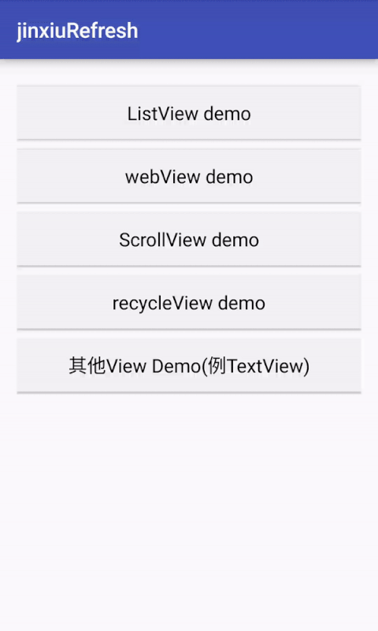
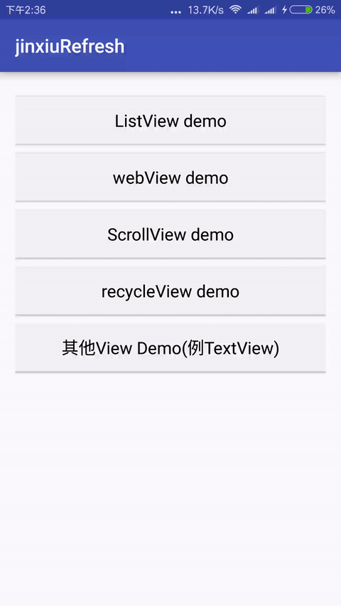
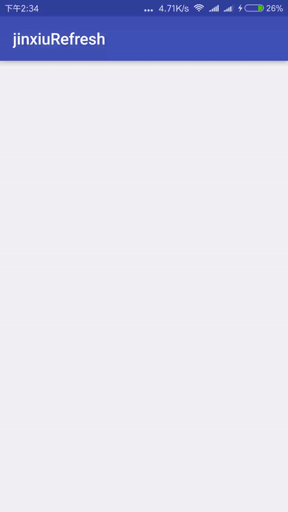

# jinxiuRefresh
Android上下拉刷新组件
  
#  使用
 1.布局文件中添加 RefreshLayout
  ```
  <com.jinxiu.refresh.views.RefreshLayout
        android:id="@+id/refresh_layout"
        android:layout_width="match_parent"
        android:layout_height="match_parent">
          <View
            android:id="@+id/id"
            android:layout_width="match_parent"
            android:layout_height="match_parent"
           />
  </com.jinxiu.refresh.views.RefreshLayout>
  ```
  
 2.设置下拉和上拉加载是否可用及监听  
  
  ```
     refreshLayout.setIsPullEnable(true);
     refreshLayout.setIsLoadMore(false);
     refreshLayout.setOnPullListener(new OnPullListener() {
            @Override
            public void onRefresh() {
                        refreshView.stopRefresh();
            }

            @Override
            public void onLoadMore() {
                        refreshView.stopLoadMore();
            }
     });
   ```
    
 3.自定义刷新头部和上拉底部
  ```
     例:只要继承PullHead类即可
     AndroidVsIosHeaderView  pullRefreshHeadView=new AndroidVsIosHeaderView(this);
     refreshLayout.setPullHeader(pullRefreshHeadView);
     底部同理refreshLayout.setPullFooter(...);
   ```
# Preview





